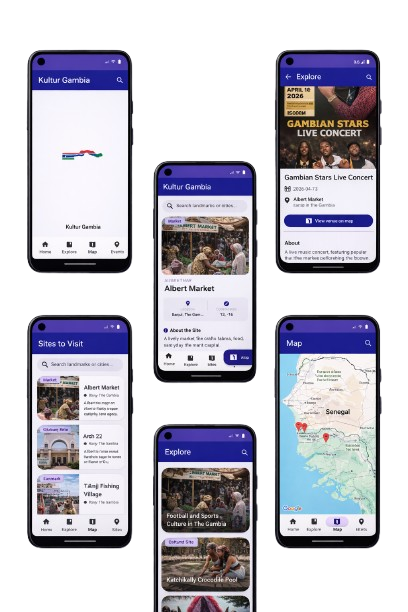

# Kultur Gambia Android App

Then reference the images in Markdown like this:

Kultur Gambia is an open-source Android application built with Jetpack Compose that showcases Gambian culture, heritage, events, and places in a modern, mobile-first experience. The app is designed to document and preserve cultural stories while making them easily accessible to both locals and a global audience.

The project emphasizes simplicity, accessibility, and community contribution, serving both as a cultural platform and a practical example of modern Android development.

## Tech Stack

Kultur Gambia is built entirely using modern Android tools and best practices. The application is written in Kotlin and uses Jetpack Compose for declarative UI development. Material 3 is used for theming and UI components to ensure a consistent and modern design language across the app. Navigation Compose handles in-app navigation, enabling a single-activity architecture with multiple composable screens.

The build system is powered by Gradle using Kotlin DSL, and Coil is used for efficient image loading and rendering within Compose.

## Features

The app allows users to explore curated cultural content across categories such as music, dance, food, clothing, festivals, history, and language. Each cultural item includes descriptive content and imagery to provide context and depth.

Users can save their favorite cultural items for quick access later through a dedicated Saved screen. The app also includes screens for cultural places and events, helping users discover locations and activities connected to Gambian heritage.

Community participation is supported through a story submission feature, allowing users to contribute their own cultural stories directly from the app.

## Architecture

Kultur Gambia follows a single-activity architecture with all UI rendered using Jetpack Compose. Application state is managed using Compose state utilities such as `remember` and `rememberSaveable`, while side effects and asynchronous tasks are handled using Kotlin coroutines.

Data is currently sourced from local JSON assets and accessed through repository classes. This design makes it easy to later introduce remote data sources or persistent storage without major architectural changes.

## Usage

When the app is launched, users are greeted with a simple splash screen before being taken to the Home screen. From the Home screen, users can browse cultural stories and explore featured content.

The bottom navigation allows users to switch between Home, Explore, Map, Events, and Saved screens. The Explore section enables browsing by categories, while the Map and Events sections provide location-based and event-related cultural information.

Users can tap on any cultural item to view detailed information. Items they find interesting can be saved and later accessed from the Saved screen. The app also allows users to submit new cultural stories using the Submit Story feature, where they can add text content and upload an image.
